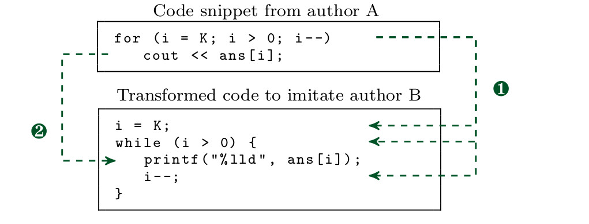

# Source Code Imitator

This repository belongs to our publication:

---

Erwin Quiring, Alwin Maier, and Konrad Rieck. Misleading Authorship Attribution of Source Code using Adversarial Learning. *Proc. of USENIX Security Symposium*, 2019.

---

You can find the code and datasets from our paper in this repository, and a copy of our paper
[here](https://arxiv.org/abs/1905.12386).

## Background
We present a novel attack against authorship
attribution of source code.
We exploit that recent attribution methods rest on machine learning and
thus can be deceived by adversarial examples of source code.
Our attack performs a series of semantics-preserving
code transformations that mislead learning-based attribution but appear
plausible to a developer.
The attack is guided by Monte-Carlo tree search that enables us to
operate in the discrete domain of source code.

As an example, the figure below shows two
transformations performed by our attack on a code snippet from the
Google Code Jam competition. The first transformation changes the for-loop
to a while-loop, while the second replaces the C++ operator `<<`
with the C-style function `printf`. Note that the format string
is automatically inferred from the variable type.  Both
transformations change the stylistic patterns of author A and, in
combination, mislead the attribution to author B.

<p align="center">

</p>

In summary, we make the following contributions:
- *Adversarial learning on source code.* We create adversarial examples
of source code. We consider targeted as well as untargeted attacks of the attribution method.

-  *Problem-Feature Space Dilemma.*
In contrast to adversarial examples in the popular image domain, we
work in a discrete space where a bijective mapping between the problem space
(source code) and the feature space does not exist.  
Our attack thus illustrates how adversarial learning can be conducted when the problem and feature space are disconnected.

- *Monte-Carlo tree search.* To this end, we introduce Monte-Carlo tree search as a novel approach to guide the creation of adversarial examples, such that feasibility constraints in the domain of source code are satisfied.

- *Black-box attack strategy.* The devised attack does not require internal knowledge of the attribution method, so that it is applicable to any learning algorithm and suitable for evading a wide range of attribution methods.

- *Large-scale evaluation.* We empirically evaluate our attack on a dataset of 204 programmers against two recent attribution methods.

## Dataset and Implementation

You can find the data set and our implementation in the respective
`data` and `src` directory. Any further directory has its own README file.

This repository allows you to perform
1. *code authorship attribution*. We have a simple API to load features, test
things and apply learning algorithms. You can easily add new features if
you are looking for novel ways to identify authors. The code is properly
separated from all evasion stuff.

2. *evasion attacks*. You can also use our code transformers to evaluate the
robustness of current attribution methods against attacks.

If you are using our implementation, please cite our USENIX paper.
You may use the following BibTex entry:
```
@INPROCEEDINGS{QuiMaiRie19,
  author = {Erwin Quiring and Alwin Maier and Konrad Rieck},
  title = {Misleading Authorship Attribution of Source Code using Adversarial Learning},
  booktitle = {Proc. of USENIX Security Symposium},
  year = {2019},
}
```   
